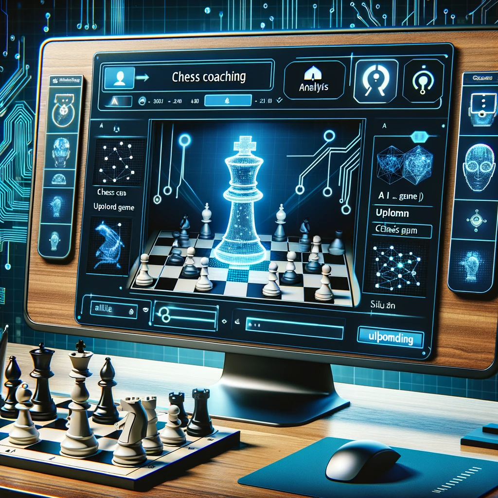
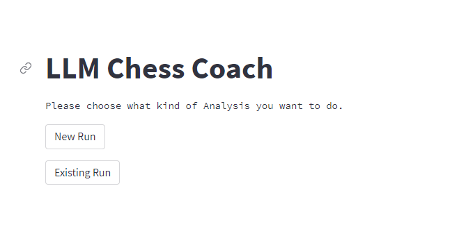
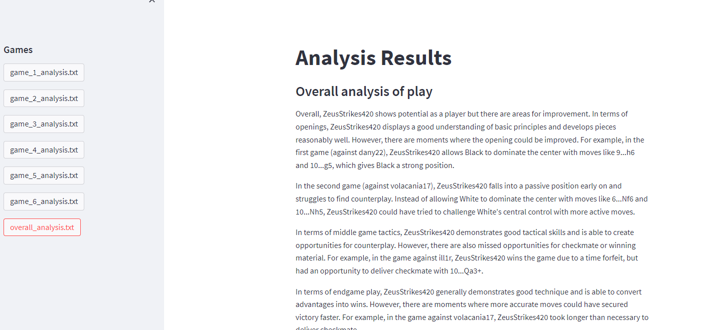

# LLM-ChessCoach


## Introduction
LLM-ChessCoach is an innovative tool that leverages Large Language Models (LLM), specifically GPT-3, along with the Stockfish engine to analyze chess games. It fetches games from online chess platforms, analyzes them, and provides insightful feedback to help players improve their strategies. A lightweight React front end allows scheduling new analyses and reviewing results from any device.

## Features
- **Game Import**: Downloads games from online chess platforms.
- **Advanced Analysis**: Uses GPT-3 and Stockfish to provide detailed game analyses.
- **Batch Processing**: Analyzes multiple games concurrently for efficiency.
- **Scheduling**: Background jobs can be scheduled to fetch and analyze new games automatically.
- **Player Dashboard**: Track analysis history and scheduled runs via a React interface.
- **Social Sharing**: Share analysis links generated by the API.
- **User-Friendly Interface**: React-based front end for all interactions.

## Components
1. `api_server.py`: FastAPI server providing REST endpoints (mobile-first MVP).
2. `stockfish_engine.py`: Engine wrapper with MultiPV and mover-perspective loss.
3. `live_sessions.py`: In-memory live sessions (play vs engine) with SSE streaming.
4. `analysis_pipeline.py`: Batch PGN analysis to MoveFeedback + summary.
5. `llm_coach.py`: LLM-backed coaching with rule-based fallback and drills.
6. `schemas.py`: Pydantic models for API responses.
7. `export_lichess_games.py`: Lichess fetcher (reads token from env var).
8. `legacy/`: Previous Streamlit and React UI kept for reference.

## Installation
1. Clone the repository.
2. Install dependencies: `pip install -r requirements.txt`.
3. Install the Stockfish engine (`apt install stockfish` on Ubuntu).
4. Set up your Lichess API token in `config.json`.

## Usage
### API (mobile-first)
Start the API server: `uvicorn api_server:app --reload`.

Auth: set `API_KEY` in environment and include `Authorization: Bearer <API_KEY>` in requests.

Key endpoints:
- `POST /v1/sessions?skill_level=intermediate` → `{session_id, fen_start}`
- `POST /v1/sessions/{id}/move?move=e4` → per-move feedback (basic+extended+drills)
- `GET /v1/sessions/{id}/stream?move=e4` (SSE) → `basic` then `extended` events
- `POST /v1/runs` (body: `pgn`) → full game feedback and summary

### Legacy UIs
Streamlit and the previous React demo are available under `legacy/`.

### LLM Model
- The backend uses OpenAI models for extended coaching and drills. By default it targets `gpt-5-nano`.
- You can override with `OPENAI_MODEL` (e.g., `gpt-5`, `gpt-5-pro`), but models older than GPT‑5 are ignored in favor of `gpt-5-nano` to preserve chess understanding quality.

### LunaNetEngine Sample Workflow
Fetch a small sample of PGNs from Lichess for the `LunaNetEngine` account and run both a short per-move sample and full-game batch analysis. Results are written to `samples/luna/analysis/`.

1) Fetch games (optionally set `LICHESS_API_TOKEN` for higher limits):

```
python3 scripts/fetch_luna_games.py --username LunaNetEngine --max_games 5 --output_dir samples/luna/raw
```

2) Run analysis on the latest fetched file (uses Stockfish + ChatGPT if `OPENAI_API_KEY` is set):

```
python3 scripts/run_luna_analysis.py --raw_dir samples/luna/raw --out_dir samples/luna/analysis --level expert --sample_moves 12
```

3) Review outputs:
- `samples/luna/analysis/full_*.json` and `.txt`: complete per-move feedback + summary
- `samples/luna/analysis/sample_*.json` and `.txt`: first N moves for a quick spot check

## Deployment
1. Build any static assets for the React UI if needed and place them in `react-ui`.
2. Deploy the FastAPI server using a production server such as `uvicorn` or `gunicorn`.
3. Configure a reverse proxy (NGINX or similar) to serve the API and static React files.
4. Ensure the `games/` directory is writable for storing downloaded games and analyses.

## Contributing
Contributions are welcome. Please read the contributing guidelines first.

## License
This project is licensed under the MIT License - see [LICENSE](LICENSE) for details.

## Acknowledgements
- Chess websites for game data.
- OpenAI's GPT-3 for game analysis.


## UI Screenshots




